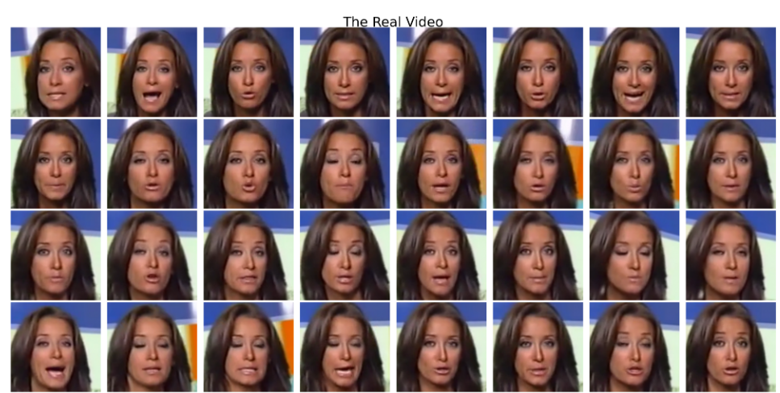
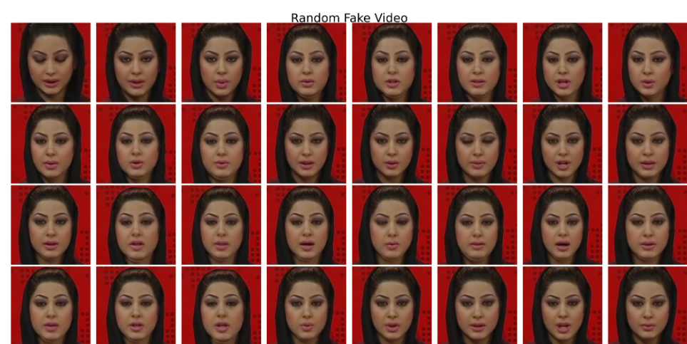
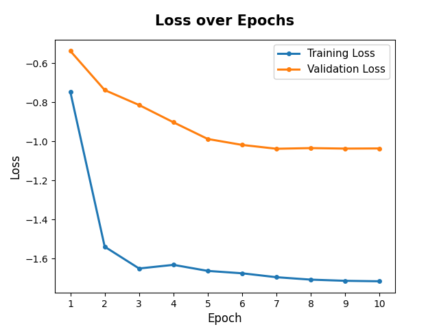
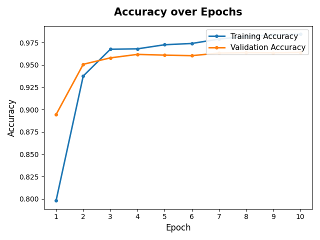
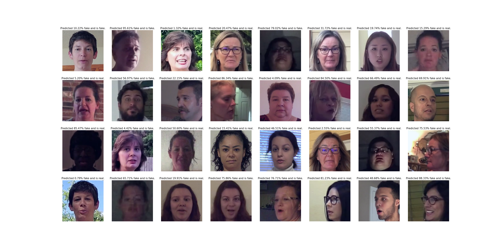
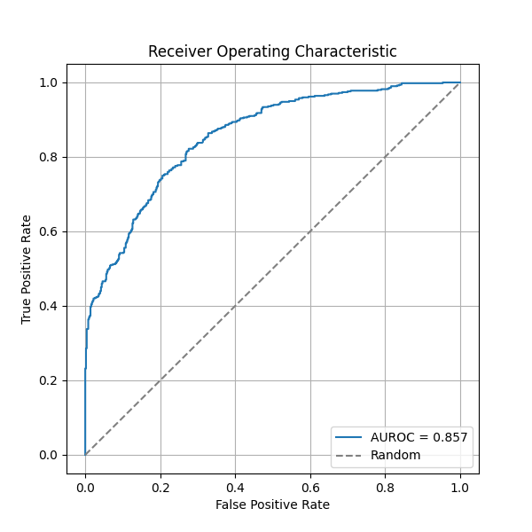

# DF-Detector

A lightweight, reproducible deepfake video detector based on **GenD** ([*Deepfake Detection that Generalizes Across Benchmarks*](https://arxiv.org/abs/2508.06248), Yermakov et al.). A frozen CLIP ViT-L/14 visual encoder is adapted for real/fake classification by fine-tuning **only its LayerNorm parameters** (~0.03% of weights) plus a linear head on top of an L2-normalized CLS token, trained with a combination of binary cross-entropy, alignment, and uniformity losses on the hypersphere.

## Pipeline

```
preprocess/  →  train/
raw videos      extract faces per frame → train CLIP+LN classifier → test/eval
```

1. **Preprocess** — samples frames from FaceForensics++ (training) and DFDC (testing) videos, detects and aligns faces with RetinaFace, crops/resizes them, and writes labeled PNG frames + a `paths.json` manifest.
2. **Train** — fine-tunes the LayerNorm layers of a CLIP ViT-L/14 encoder and a linear classification head on the preprocessed frames.
3. **Test** — runs the trained model on held-out videos, averaging per-frame fake probabilities into a video-level score, and reports ROC-AUC.

## Installation

```bash
pip install -r requirements.txt
pip install --no-deps -r requirements-nodeps.txt   # retina-face (pulls in an old TF pin otherwise)
```

Requires a CUDA-capable GPU for reasonable training/preprocessing speed (RetinaFace inference and CLIP forward/backward passes are the bottlenecks).

## Usage

### 1. Preprocess data

```bash
python -m preprocess.preprocess <FF++_ROOT> <DFDC_ROOT> \
    --processed-data-dir data \
    --n-data 1000 --n-test 1000 \
    --total-frames 32 --img-dims 224 224 --scale 1.3
```

- `<FF++_ROOT>` — FaceForensics++ root, expected to contain `manipulated_sequences/{Deepfakes,Face2Face,FaceShifter,FaceSwap}/c23/videos` and `original_sequences/youtube/c23/videos`.
- `<DFDC_ROOT>` — DFDC root containing `dfdc_train_part_0X/dfdc_train_part_X/metadata.json`.
- For each of `--n-data` sampled real videos, all 4 corresponding manipulated variants are also pulled in, giving 5× that many training videos. `--total-frames` frames are uniformly sampled per video, the largest face is detected and aligned via RetinaFace + similarity transform, then cropped to `--img-dims` with the given margin `--scale`.
- Outputs `data/train/` and `data/test/` folders of cropped face frames plus `paths.json` label manifests, and saves example frame grids (`Random Fake Video.png`, `Random Real Video.png`) to the plot directory (default `.out/`).

Example preprocessed frames:

| Real | Fake |
|---|---|
|  |  |

### 2. Train

```bash
python -m train.train --data-dir data --epochs 20 --batch-size 32 --lr 3e-4
```

- Loads a pretrained CLIP ViT-L/14 visual encoder (via the `clip` package), strips its final projection, and wraps it in `CLIPBinaryClassifier`: L2-normalized CLS token → linear layer → fake logit. Only parameters with `"ln"` in their name (LayerNorm affine params) and the linear head are trainable; the rest of CLIP is frozen.
- Optimized with Adam and a cyclic warmup + cosine-decay LR schedule (`CosineCyclicWarmupLR`), using `CLIPLoss` = BCE + `alpha` × alignment loss + `beta` × uniformity loss on the L2-normalized embeddings.
- Data is split into train/val by video (not by frame) to avoid leakage, since each video contributes `--total-frames` consecutive frame files.
- Saves the best-validation-loss checkpoint (`best_model.pt`) plus a checkpoint per epoch, and writes loss/accuracy curves to the plot directory (default `.out/`).

Example training curves from a reference run:

| Loss | Accuracy |
|---|---|
|  |  |

Training loss/accuracy converge quickly and cleanly; validation tracks training closely with no strong divergence, consistent with LN-tuning's resistance to overfitting compared to full fine-tuning.

### 3. Test

```bash
python -m train.test best_model.pt --data-dir data
```

- Loads the checkpoint into the same `CLIPBinaryClassifier` architecture, runs inference over the test set frame-by-frame, and averages sigmoid probabilities within each video (`predict_video`) to get one fake-probability score per video.
- Saves a grid of sample videos with their predicted fake probability and ground-truth label (`predictions.png`) and the ROC curve with video-level AUROC (`auroc.png`) to the plot directory.

Example outputs from a reference run:




## Project layout

```
preprocess/
  preprocess.py    # CLI entry point: dataset sampling, face extraction, frame export
  img_utils.py      # RetinaFace inference, face alignment/cropping (Kornia-based)
  path_utils.py      # FF++ / DFDC video path + label discovery
  plot_utils.py       # sample-frame grid visualization
train/
  train.py          # CLI entry point: training loop, checkpointing, curve plots
  test.py            # CLI entry point: video-level inference, ROC-AUC, prediction grid
  model.py           # CLIP visual encoder loader + CLIPBinaryClassifier
  loss.py            # CLIPLoss (BCE + alignment + uniformity), CosineCyclicWarmupLR
  dataset.py          # ImageDataset (reads frame files + labels)
  common_utils.py       # paths.json (frame path ↔ label) loader
utils/
  consts.py           # default paths, hyperparameters, device/dtype config
```

## Key defaults (`utils/consts.py`)

| Setting | Value |
|---|---|
| Deepfake methods | Deepfakes, Face2Face, FaceShifter, FaceSwap |
| Frames per video | 32 |
| Face crop size | 224×224 |
| Crop margin scale | 1.3 |
| Batch size | 32 |
| Epochs | 20 |
| LR (max / min) | 3e-4 / 1e-5 |
| Val split | 0.3 |

## Notes

- Only CLIP's LayerNorm affine parameters and the final linear layer are trained, this keeps the adapted model to a tiny fraction of total parameters, trains fast, and generalizes better than full fine-tuning (see the GenD paper).
- Video-level scores are obtained by simple mean-pooling of per-frame sigmoid probabilities.
- `retina-face` is installed with `--no-deps` because it pins an old TensorFlow version that isn't needed for inference here.
